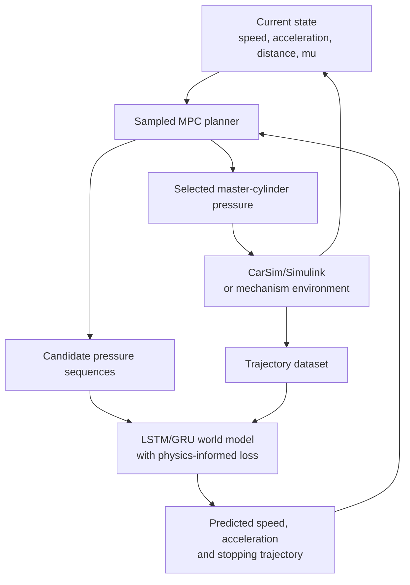

# World Model in Brake System

[中文说明](README_zh-CN.md) | English

A longitudinal braking world-model project that connects mechanism modeling,
high-fidelity CarSim/Simulink co-simulation, sequence learning, physics-informed
training, and sampled model predictive control (MPC).

The project is designed around a one-dimensional emergency-stopping scenario:
given vehicle state, road adhesion, and brake pressure, learn the chassis
dynamics and use the learned model to plan a safe and comfortable stop.

## Project Status

| Module | Implementation | Status |
|---|---|---|
| Mechanism environment | MATLAB longitudinal braking model | Complete |
| Transition data | Random `[v, P, mu]` sampling | Complete |
| Baseline world model | MATLAB MLP, one-step prediction | Complete |
| Sequence data | Continuous braking trajectories | Complete |
| Sequence world model | PyTorch GRU default, LSTM comparison | Complete |
| Physics-informed loss | Velocity integration consistency | Complete |
| Upper-level planner | Sampled one-dimensional MPC | Complete |
| CarSim integration | Real VehicleSim S-Function seed model and setup tools | In integration |
| CarSim batch dataset | Manifest-driven CarSim/Simulink collection | Ready for run files |

The repository contains generated demonstration models, datasets, plots, and a
three-speaker presentation. Machine-specific CarSim run files are intentionally
not embedded in the shared manifest.

## System Architecture



The three layers have separate responsibilities:

1. **Environment:** the MATLAB mechanism model provides a reproducible baseline;
   CarSim provides higher-fidelity vehicle dynamics.
2. **World model:** MLP or LSTM/GRU predicts the next speed and acceleration.
3. **Planner:** sampled MPC searches pressure sequences and executes the first
   action of the lowest-cost sequence.

## Core Formulation

The baseline transition model uses:

```text
input:  [v_t, a_t, P_t, mu_t]
output: [v_(t+1), a_(t+1)]
```

The sequence model receives the latest `K` transitions, with `K = 5` by default:

```text
[[v, a, P, mu]_(t-K+1), ..., [v, a, P, mu]_t]
    -> [v_(t+1), a_(t+1)]
```

The physics-informed velocity residual is:

```text
r_v = v_next_pred - max(v_t + a_next_pred * dt, 0)
Loss = MSE(y_pred, y_true) + lambda_pinn * mean(r_v^2)
```

The stopping planner balances terminal distance, deceleration, pressure
smoothness, collision risk, and failure to stop:

```text
J = w_distance * (x_stop - d_safe)^2
  + w_decel * max(|a|)^2
  + w_smooth * mean(delta_P^2)
  + collision_penalty
  + not_stop_penalty
```

## Repository Layout

```text
.
|-- config/       CarSim batch case manifest
|-- data/         Mechanism and sequence datasets
|-- docs/         Engineering guide, CarSim guide, and presentation
|-- models/       Simulink models and trained model checkpoints
|-- python/       Dataset generation, LSTM/GRU training, and MPC
|-- results/      Metrics, scenario CSV files, and figures
|-- scripts/      MATLAB entry points and CarSim integration tools
|-- src/          MATLAB dynamics, MLP, evaluation, and planning functions
|-- README.md
`-- README_zh-CN.md
```

Important entry points:

| File | Purpose |
|---|---|
| `scripts/run_all.m` | Run the complete MATLAB baseline |
| `scripts/verify_carsim_prerequisites.m` | Check Simulink, `vs_sf`, and seed model |
| `scripts/setup_carsim_cosim.m` | Build the project CarSim co-simulation model |
| `scripts/carsim_collect_dataset.m` | Run manifest-driven CarSim data collection |
| `python/train_sequence_world_model.py` | Train LSTM/GRU with PINN loss |
| `python/plan_stop_mpc.py` | Run the sampled stopping MPC demonstration |

## Requirements

### MATLAB baseline

- MATLAB
- Simulink

### Python world model

- Python 3.9 or newer
- PyTorch
- NumPy
- pandas
- Matplotlib

### CarSim co-simulation

- CarSim with a compatible 64-bit VehicleSim S-Function
- MATLAB/Simulink supported by the installed CarSim version
- A CarSim Run configured with the required imports and exports

The current local integration was developed with MATLAB R2024b and CarSim
2019.0. Other versions may expose different paths or dialog parameters.

## Quick Start: MATLAB Baseline

Start MATLAB in the repository root, or switch to it before adding paths:

```matlab
projectRoot = "C:\path\to\World Model in Brake System";
cd(projectRoot);
addpath("src");
addpath("scripts");

run("scripts/run_all.m");
```

This workflow:

1. generates 30,000 transition samples;
2. generates 800 sequence trajectories;
3. trains the MATLAB MLP;
4. evaluates one-step prediction;
5. runs the baseline safety-planning scenario; and
6. generates the simplified Simulink mechanism model.

Main outputs:

```text
data/brake_dataset.csv
data/brake_sequence_dataset.csv
models/world_model_mlp.mat
models/brake_mechanism_model.slx
results/world_model_metrics.csv
results/prediction_compare.png
results/safety_planning_scenario.png
```

## Quick Start: Python LSTM/PINN and MPC

The existing Conda environment is named `rl_env`. From PowerShell:

```powershell
& "C:\Users\MrZang\anaconda3\condabin\conda.bat" run -n rl_env `
  python -m pip install -r requirements.txt
```

Verify the environment:

```powershell
& "C:\Users\MrZang\anaconda3\condabin\conda.bat" run -n rl_env `
  python -s -c "import torch, numpy, pandas, matplotlib; print(torch.__version__, torch.cuda.is_available())"
```

Generate mechanism-based sequence data when needed:

```powershell
& "C:\Users\MrZang\anaconda3\condabin\conda.bat" run -n rl_env `
  python python/generate_sequence_dataset.py `
  --out data/brake_sequence_dataset.csv
```

Train the default single-layer GRU/PINN sequence model:

```powershell
& "C:\Users\MrZang\anaconda3\condabin\conda.bat" run -n rl_env `
  python python/train_sequence_world_model.py `
  --data data/brake_sequence_dataset.csv `
  --epochs 40 `
  --sequence-len 5 `
  --recurrent gru `
  --pinn-weight 0.05
```

Run the reproducible eight-configuration LSTM/GRU ablation:

```powershell
& "C:\Users\MrZang\anaconda3\condabin\conda.bat" run -n rl_env `
  python python/run_recurrent_ablation.py `
  --data data/brake_sequence_dataset.csv `
  --epochs 40 `
  --force
```

Run sampled MPC:

```powershell
& "C:\Users\MrZang\anaconda3\condabin\conda.bat" run -n rl_env `
  python python/plan_stop_mpc.py `
  --model models/world_model_gru.pt
```

If the checkpoint cannot be loaded, the MPC script reports the reason and
falls back to the mechanism predictor so that the planning pipeline remains
executable.

## CarSim/Simulink Co-Simulation

See the detailed guide:
[docs/carsim_cosimulation_setup.md](docs/carsim_cosimulation_setup.md).

### 1. Configure the CarSim Run

Use a straight-road braking Run with approximately the following values:

| Item | Project setting |
|---|---:|
| Total vehicle mass | 1800 kg |
| Initial speed | 20-120 km/h |
| Master-cylinder pressure | 0-10 MPa |
| Road adhesion coefficient | 0.2, 0.4, 0.6, 0.8 |
| CarSim solver step | 0.001 s |
| ML dataset step | 0.05 s |

In `Models: Simulink`, configure imports in this exact order:

```text
IMP_PBK_L1
IMP_PBK_L2
IMP_PBK_R1
IMP_PBK_R2
```

Configure exports in this exact order:

```text
Vx_SM
Ax_SM
```

The project sends the same pressure command to all four wheels. Import/export
order matters because the S-Function exchanges vectors rather than signal
names.

### 2. Create the seed model

In CarSim:

1. open the configured Run;
2. select `Send to Simulink`;
3. save the generated model as `models/carsim_seed_model.slx`; and
4. keep the generated `.sim` descriptor, such as
   `F:\Carsim\UserData\simfile.sim`.

Do not replace the VehicleSim block with a generic Simulink S-Function. The
CarSim-generated block carries the solver, Run, and port configuration.

### 3. Verify and generate the project model

In MATLAB, from the repository root:

```matlab
addpath("src");
addpath("scripts");

verify_carsim_prerequisites();

setup_carsim_cosim( ...
    "models/carsim_seed_model.slx", ...
    SimFilePath="F:\Carsim\UserData\simfile.sim", ...
    Overwrite=true);
```

`SimFilePath` is machine-specific. The setup script can automatically resolve
common locations, but an absolute path is recommended for reproducibility.

Expected outputs:

```text
models/carsim_brake_cosim.slx
results/carsim_interface_report.tsv
config/carsim_case_manifest.csv
```

For CarSim 2019.0, the inspected S-Function parameter is `SIMFILE`. The generated
project model stores an absolute `.sim` path, avoiding failures after MATLAB
changes its working directory.

### 4. Prepare the batch manifest

The generated manifest covers:

```text
6 initial speeds x 4 mu values x 5 pressure-profile replicates = 120 cases
```

Copy it before adding local machine paths:

```matlab
copyfile( ...
    "config/carsim_case_manifest.csv", ...
    "config/carsim_case_manifest.local.csv");
```

Fill the `run_file` column with the `.sim` descriptor associated with each
CarSim speed/road condition. Replicates with the same speed and `mu` may share
one run file.

### 5. Collect a smoke-test dataset

Keep one valid row in the local manifest first:

```matlab
dataset = carsim_collect_dataset( ...
    "config/carsim_case_manifest.local.csv", ...
    "data/carsim_smoke_dataset.csv", ...
    ModelPath="models/carsim_brake_cosim.slx", ...
    RunFileDialogParameter="SIMFILE");
```

The collector validates missing outputs, NaNs, timeseries types, and mismatch
between manifest speed and actual initial CarSim speed.

After one case succeeds, restore the full manifest:

```matlab
dataset = carsim_collect_dataset( ...
    "config/carsim_case_manifest.local.csv", ...
    "data/carsim_brake_sequence_dataset.csv", ...
    ModelPath="models/carsim_brake_cosim.slx", ...
    RunFileDialogParameter="SIMFILE", ...
    SaveRawOutputs=false);
```

Then train directly on the CarSim dataset:

```powershell
& "C:\Users\MrZang\anaconda3\condabin\conda.bat" run -n rl_env `
  python python/train_sequence_world_model.py `
  --data data/carsim_brake_sequence_dataset.csv
```

## Dataset Schema

The sequence and CarSim datasets use the following principal columns:

| Column | Description |
|---|---|
| `trajectory_id` | Trajectory/case identifier |
| `step` | Discrete time index |
| `time_s` | Simulation time |
| `v_mps` | Current longitudinal speed |
| `a_mps2` | Current longitudinal acceleration |
| `pressure_MPa` | Current brake-pressure command |
| `mu` | Road adhesion coefficient |
| `v_next_mps` | Next-step speed target |
| `a_next_mps2` | Next-step acceleration target |
| `initial_speed_kph` | CarSim case initial speed, when available |
| `source` | Data source, when available |

The training loader requires the first nine fields. Additional CarSim analysis
columns are retained without changing the learning interface.

## Current Parameters

The mechanism model defaults are defined in `src/defaultBrakeParams.m`:

| Parameter | Value |
|---|---:|
| Vehicle mass | 1800 kg |
| Gravity | 9.81 m/s^2 |
| Reference brake gain | 3500 N/MPa |
| Dataset step | 0.05 s |
| Comfort deceleration envelope | 8.0 m/s^2 |

CarSim unit conversion and interface settings are defined in
`src/defaultCarSimConfig.m`. Confirm the CarSim user units before changing:

```matlab
cfg.pressureToCarSim
cfg.speedToMps
cfg.accelToMps2
```

After collecting dry-road, low-pressure CarSim data, estimate the equivalent
brake gain with:

```matlab
calibrate_carsim_brake_gain( ...
    "data/carsim_brake_sequence_dataset.csv");
```

## Results and Presentation

Representative generated artifacts include:

- `results/sequence_world_model_metrics.csv`
- `results/recurrent_ablation/comparison.csv`
- `results/recurrent_ablation/report.md`
- `results/sequence_training_loss.png`
- `results/mpc_stop_scenario.csv`
- `results/mpc_stop_scenario.png`
- `docs/World_Model_Brake_System_12min_3speakers.pptx`


## Troubleshooting

### MATLAB cannot find project functions

MATLAB is in another working folder. Switch to the repository root first:

```matlab
cd("C:\path\to\World Model in Brake System");
addpath("src");
addpath("scripts");
```

### `Unable to find solver DLL path from sim file`

The VehicleSim block is using a relative `simfile.sim` while MATLAB is in
another directory. Rebuild with an absolute path:

```matlab
setup_carsim_cosim( ...
    "models/carsim_seed_model.slx", ...
    SimFilePath="F:\Carsim\UserData\simfile.sim", ...
    Overwrite=true);
```

### `vs_sf` is unavailable

Open the Run in CarSim and use `Send to Simulink`, then check:

```matlab
which vs_sf
verify_carsim_prerequisites();
```

### CarSim block has incorrect port dimensions

Recheck the exact import/export order in the CarSim Run and create a new seed
model with `Send to Simulink`.

### Speed differs by a factor of 3.6

Check the `Vx_SM` user unit and `cfg.speedToMps`.

### Acceleration differs by approximately 9.81

Check whether `Ax_SM` is exported in `g` or `m/s^2`, then update
`cfg.accelToMps2`.

### `ImportError: cannot import name 'Image' from 'PIL'`

Repair Pillow in the active Conda environment:

```powershell
& "C:\Users\MrZang\anaconda3\condabin\conda.bat" run -n rl_env `
  python -m pip install --upgrade --force-reinstall pillow
```

## Known Limitations

- The current planning task is one-dimensional and assumes a stationary
  obstacle.
- The baseline mechanism environment is intentionally simplified.
- `mu` is currently represented through separate CarSim Run/road conditions,
  not a universal runtime friction import.
- The MPC demonstration predicts with the learned model but executes against
  the mechanism environment; replacing execution with live CarSim feedback is
  the next closed-loop integration step.
- The manifest must reference locally generated CarSim `.sim` files before
  high-fidelity batch collection can run.

## Documentation

- [Engineering implementation plan](docs/engineering_implementation_plan.md)
- [LSTM/GRU ablation study](docs/recurrent_model_ablation.md)
- [CarSim/Simulink setup guide](docs/carsim_cosimulation_setup.md)
- [12-minute, three-speaker presentation](docs/World_Model_Brake_System_12min_3speakers.pptx)
