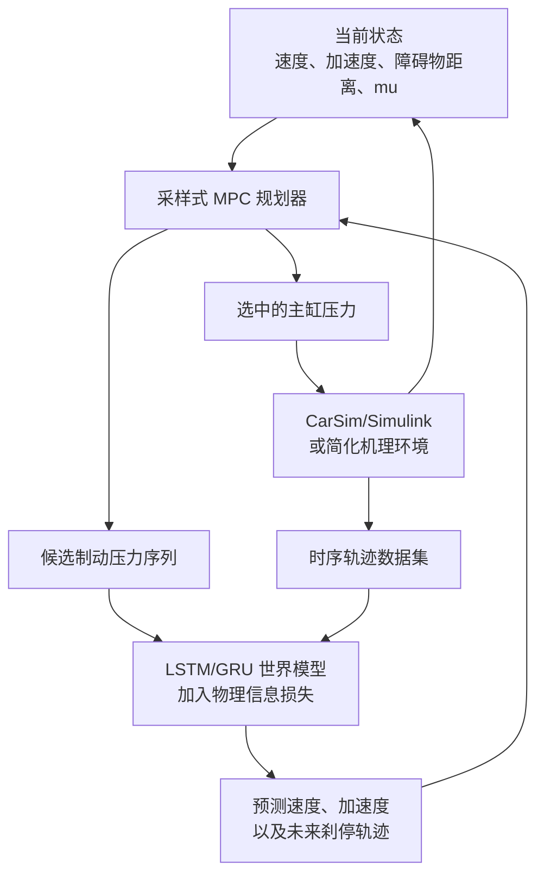
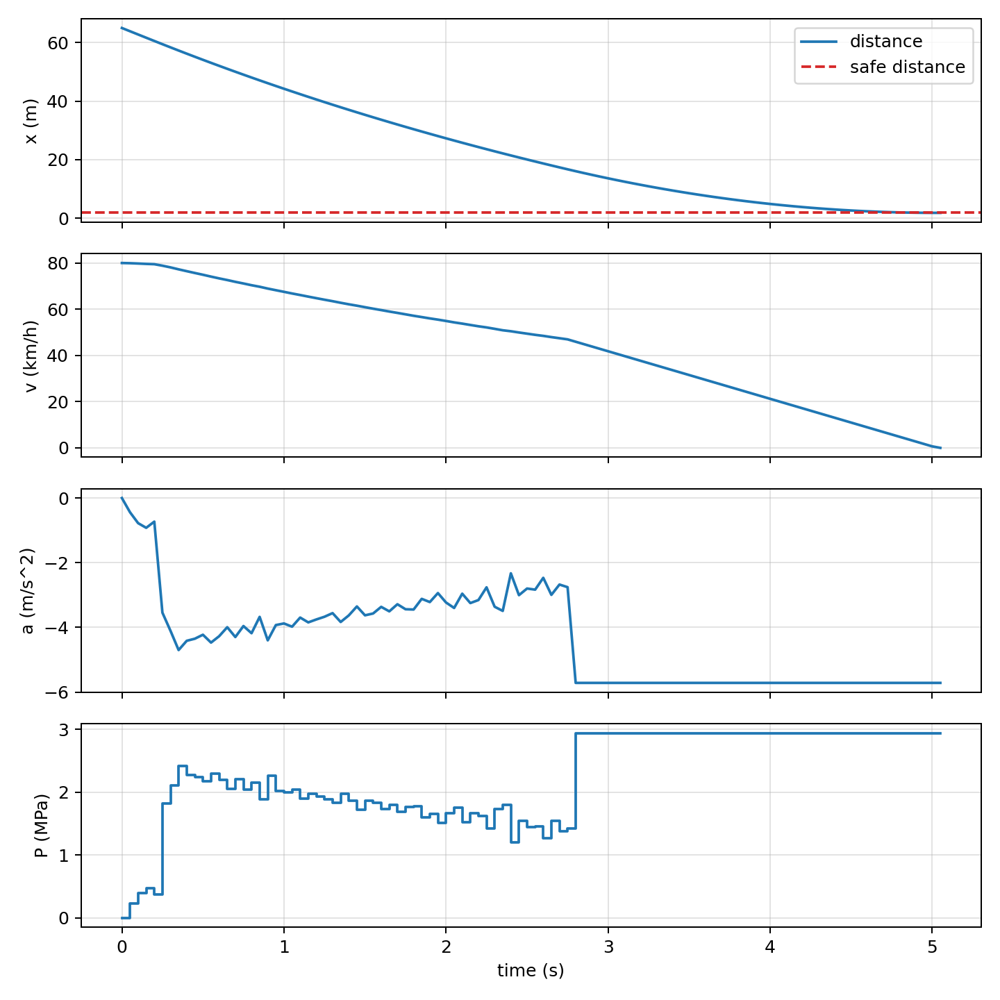

# 制动系统世界模型

中文 | [English](README.md)

本项目实现了一套纵向制动世界模型工程链路，将简化机理建模、CarSim/Simulink
高保真联合仿真、时序神经网络、物理信息约束和采样式模型预测控制（MPC）连接起来。

项目聚焦一维直线刹停场景：根据车辆状态、路面附着系数和制动压力学习底盘动力学，
再利用学习到的世界模型规划兼顾安全距离与舒适性的制动动作。

## 当前进度

| 模块 | 实现方式 | 状态 |
|---|---|---|
| 机理环境 | MATLAB 纵向制动模型 | 已完成 |
| 单步数据 | 随机采样 `[v, P, mu]` | 已完成 |
| 基线世界模型 | MATLAB MLP 单步预测 | 已完成 |
| 时序数据 | 连续制动轨迹 | 已完成 |
| 时序世界模型 | PyTorch LSTM/GRU | 已完成 |
| 物理信息损失 | 速度积分一致性约束 | 已完成 |
| 上层规划器 | 一维采样式 MPC | 已完成 |
| CarSim 接口 | 真实 VehicleSim S-Function 与自动建模脚本 | 联调中 |
| CarSim 批量数据 | 基于工况清单的联合仿真采集 | 等待填写本机 Run 文件 |

仓库中已经包含可演示的模型、数据、图表和三人汇报 PPT。CarSim 的 `.sim`
工况文件与机器和本地数据库相关，因此共享工况清单中不直接写死这些路径。

## 系统架构



三层模块职责如下：

1. **下层环境**：MATLAB 机理模型用于快速、可复现地跑通闭环；CarSim 用于提高车辆
   动力学保真度。
2. **中层世界模型**：MLP 或 LSTM/GRU 预测下一时刻车速与纵向加速度。
3. **上层规划器**：采样多条未来压力序列，选择总代价最低序列的第一个动作执行。

## 核心建模形式

基线单步模型的输入输出为：

```text
输入：[v_t, a_t, P_t, mu_t]
输出：[v_(t+1), a_(t+1)]
```

时序模型默认输入最近 `K = 5` 个时间步：

```text
[[v, a, P, mu]_(t-K+1), ..., [v, a, P, mu]_t]
    -> [v_(t+1), a_(t+1)]
```

训练时加入速度积分的物理一致性残差：

```text
r_v = v_next_pred - max(v_t + a_next_pred * dt, 0)
Loss = MSE(y_pred, y_true) + lambda_pinn * mean(r_v^2)
```

刹停规划代价综合终端距离、最大减速度、压力平滑性、碰撞和未能刹停：

```text
J = w_distance * (x_stop - d_safe)^2
  + w_decel * max(|a|)^2
  + w_smooth * mean(delta_P^2)
  + collision_penalty
  + not_stop_penalty
```

## 工程目录

```text
.
|-- config/       CarSim 批量工况清单
|-- data/         机理数据集与时序数据集
|-- docs/         工程指南、CarSim 指南和汇报 PPT
|-- models/       Simulink 模型与神经网络权重
|-- python/       数据生成、LSTM/GRU 训练与 MPC
|-- results/      评价指标、场景 CSV 和结果图
|-- scripts/      MATLAB 入口脚本与 CarSim 联调工具
|-- src/          MATLAB 动力学、MLP、评价和规划函数
|-- README.md
`-- README_zh-CN.md
```

主要入口：

| 文件 | 功能 |
|---|---|
| `scripts/run_all.m` | 运行完整 MATLAB 基线流程 |
| `scripts/verify_carsim_prerequisites.m` | 检查 Simulink、`vs_sf` 和种子模型 |
| `scripts/setup_carsim_cosim.m` | 自动生成项目联合仿真模型 |
| `scripts/carsim_collect_dataset.m` | 按工况清单批量采集 CarSim 数据 |
| `python/train_sequence_world_model.py` | 训练带 PINN 损失的 LSTM/GRU |
| `python/plan_stop_mpc.py` | 运行一维采样式 MPC 刹停示例 |

## 环境要求

### MATLAB 基线

- MATLAB
- Simulink

### Python 世界模型

- Python 3.9 或更高版本
- PyTorch
- NumPy
- pandas
- Matplotlib

### CarSim 联合仿真

- CarSim 及兼容的 64 位 VehicleSim S-Function
- 与当前 CarSim 版本兼容的 MATLAB/Simulink
- 已配置正确 Import/Export 的 CarSim Run

当前本机联调环境为 MATLAB R2024b 与 CarSim 2019.0。其他版本可能使用不同的安装
路径或 S-Function 参数名。

## 快速运行：MATLAB 基线

启动 MATLAB 后，先切换到项目根目录：

```matlab
projectRoot = "C:\path\to\World Model in Brake System";
cd(projectRoot);
addpath("src");
addpath("scripts");

run("scripts/run_all.m");
```

该流程会：

1. 生成 30,000 条单步 transition 数据；
2. 生成 800 条时序轨迹；
3. 训练 MATLAB MLP；
4. 评价单步预测性能；
5. 运行基线安全规划场景；
6. 生成简化制动 Simulink 模型。

主要产物：

```text
data/brake_dataset.csv
data/brake_sequence_dataset.csv
models/world_model_mlp.mat
models/brake_mechanism_model.slx
results/world_model_metrics.csv
results/prediction_compare.png
results/safety_planning_scenario.png
```

## 快速运行：Python LSTM/PINN 与 MPC

当前使用的 Conda 环境名为 `rl_env`。在 PowerShell 中安装依赖：

```powershell
& "C:\Users\MrZang\anaconda3\condabin\conda.bat" run -n rl_env `
  python -m pip install -r requirements.txt
```

验证环境：

```powershell
& "C:\Users\MrZang\anaconda3\condabin\conda.bat" run -n rl_env `
  python -s -c "import torch, numpy, pandas, matplotlib; print(torch.__version__, torch.cuda.is_available())"
```

需要重新生成机理时序数据时：

```powershell
& "C:\Users\MrZang\anaconda3\condabin\conda.bat" run -n rl_env `
  python python/generate_sequence_dataset.py `
  --out data/brake_sequence_dataset.csv
```

训练 LSTM/PINN 世界模型：

```powershell
& "C:\Users\MrZang\anaconda3\condabin\conda.bat" run -n rl_env `
  python python/train_sequence_world_model.py `
  --data data/brake_sequence_dataset.csv `
  --epochs 40 `
  --sequence-len 5 `
  --recurrent lstm `
  --pinn-weight 0.05
```

运行采样式 MPC：

```powershell
& "C:\Users\MrZang\anaconda3\condabin\conda.bat" run -n rl_env `
  python python/plan_stop_mpc.py `
  --model models/world_model_lstm.pt
```

如果模型权重不存在或无法加载，MPC 脚本会打印原因，并自动使用机理预测器作为回退，
保证规划流程仍然可以运行。

## CarSim/Simulink 真联合仿真

更详细的界面配置与排错说明见：
[docs/carsim_cosimulation_setup.md](docs/carsim_cosimulation_setup.md)。

### 1. 配置 CarSim Run

建立平直道路制动工况，参考参数如下：

| 项目 | 工程设定 |
|---|---:|
| 整车总质量 | 1800 kg |
| 初速度 | 20-120 km/h |
| 主缸压力 | 0-10 MPa |
| 路面附着系数 | 0.2、0.4、0.6、0.8 |
| CarSim 内部求解步长 | 0.001 s |
| 机器学习数据采样周期 | 0.05 s |

在 `Models: Simulink` 中按以下顺序配置 Import：

```text
IMP_PBK_L1
IMP_PBK_L2
IMP_PBK_R1
IMP_PBK_R2
```

按以下顺序配置 Export：

```text
Vx_SM
Ax_SM
```

项目会将同一个主缸压力复制到四个车轮。S-Function 传输的是向量而不是信号名，
因此 Import/Export 的数量和顺序必须完全一致。

### 2. 生成种子模型

在 CarSim 中：

1. 打开已经配置好的 Run；
2. 点击 `Send to Simulink`；
3. 将生成的模型保存为 `models/carsim_seed_model.slx`；
4. 保留 CarSim 生成的 `.sim` 描述文件，例如
   `F:\Carsim\UserData\simfile.sim`。

不能用普通 Simulink S-Function 替换 VehicleSim 模块。CarSim 生成的模块携带了求解器、
Run 参数和端口配置信息。

### 3. 检查环境并生成项目模型

在 MATLAB 中切换到项目根目录后执行：

```matlab
addpath("src");
addpath("scripts");

verify_carsim_prerequisites();

setup_carsim_cosim( ...
    "models/carsim_seed_model.slx", ...
    SimFilePath="F:\Carsim\UserData\simfile.sim", ...
    Overwrite=true);
```

`SimFilePath` 与本机安装位置有关。脚本会尝试自动查找常见位置，但为了保证稳定复现，
建议显式传入绝对路径。

预期生成：

```text
models/carsim_brake_cosim.slx
results/carsim_interface_report.tsv
config/carsim_case_manifest.csv
```

当前 CarSim 2019.0 的接口报告显示运行文件参数名为 `SIMFILE`。生成脚本会把 `.sim`
文件写成绝对路径，避免 MATLAB 切换工作目录后 VehicleSim 找不到求解器 DLL。

### 4. 准备批量工况清单

默认清单覆盖：

```text
6 个初速度 x 4 个 mu x 5 条随机压力曲线 = 120 个工况
```

先复制一份本机清单：

```matlab
copyfile( ...
    "config/carsim_case_manifest.csv", ...
    "config/carsim_case_manifest.local.csv");
```

在本机清单的 `run_file` 列中填写每个 CarSim 速度和路面条件对应的 `.sim` 文件。
相同速度与 `mu` 下的多个 replicate 可以共用同一个 Run 文件。

### 5. 先做单工况冒烟测试

先只在本机清单中保留一条有效记录：

```matlab
dataset = carsim_collect_dataset( ...
    "config/carsim_case_manifest.local.csv", ...
    "data/carsim_smoke_dataset.csv", ...
    ModelPath="models/carsim_brake_cosim.slx", ...
    RunFileDialogParameter="SIMFILE");
```

采集器会检查输出缺失、NaN、timeseries 类型，以及清单初速度与 CarSim 实际初速度
是否一致。

单工况通过后恢复完整清单：

```matlab
dataset = carsim_collect_dataset( ...
    "config/carsim_case_manifest.local.csv", ...
    "data/carsim_brake_sequence_dataset.csv", ...
    ModelPath="models/carsim_brake_cosim.slx", ...
    RunFileDialogParameter="SIMFILE", ...
    SaveRawOutputs=false);
```

随后直接使用 CarSim 数据训练：

```powershell
& "C:\Users\MrZang\anaconda3\condabin\conda.bat" run -n rl_env `
  python python/train_sequence_world_model.py `
  --data data/carsim_brake_sequence_dataset.csv
```

## 数据集字段

时序数据和 CarSim 数据的主要字段如下：

| 字段 | 含义 |
|---|---|
| `trajectory_id` | 轨迹或工况编号 |
| `step` | 离散时间步 |
| `time_s` | 仿真时间 |
| `v_mps` | 当前纵向速度 |
| `a_mps2` | 当前纵向加速度 |
| `pressure_MPa` | 当前制动压力指令 |
| `mu` | 路面附着系数 |
| `v_next_mps` | 下一时刻速度标签 |
| `a_next_mps2` | 下一时刻加速度标签 |
| `initial_speed_kph` | CarSim 工况初速度（如有） |
| `source` | 数据来源（如有） |

训练代码需要前九个字段。CarSim 增加的分析字段会被保留，但不会改变模型的数据接口。

## 当前车辆与仿真参数

简化机理模型参数定义在 `src/defaultBrakeParams.m`：

| 参数 | 数值 |
|---|---:|
| 整车质量 | 1800 kg |
| 重力加速度 | 9.81 m/s^2 |
| 参考制动力增益 | 3500 N/MPa |
| 数据采样周期 | 0.05 s |
| 舒适减速度边界 | 8.0 m/s^2 |

CarSim 单位换算和接口设置位于 `src/defaultCarSimConfig.m`。修改前应先确认 CarSim
界面显示的 user unit：

```matlab
cfg.pressureToCarSim
cfg.speedToMps
cfg.accelToMps2
```

采集到干燥路面、低压力 CarSim 数据后，可以估计等效制动力增益：

```matlab
calibrate_carsim_brake_gain( ...
    "data/carsim_brake_sequence_dataset.csv");
```

## 结果与汇报材料

当前仓库中的主要展示产物：

- `results/sequence_world_model_metrics.csv`
- `results/sequence_training_loss.png`
- `results/mpc_stop_scenario.csv`
- `results/mpc_stop_scenario.png`
- `docs/World_Model_Brake_System_12min_3speakers.pptx`



## 常见问题

### MATLAB 找不到项目函数

MATLAB 当前目录不在项目根目录。先执行：

```matlab
cd("C:\path\to\World Model in Brake System");
addpath("src");
addpath("scripts");
```

### `Unable to find solver DLL path from sim file`

VehicleSim 模块使用了相对路径 `simfile.sim`，而 MATLAB 已经切换到其他目录。用绝对
路径重新生成模型：

```matlab
setup_carsim_cosim( ...
    "models/carsim_seed_model.slx", ...
    SimFilePath="F:\Carsim\UserData\simfile.sim", ...
    Overwrite=true);
```

### 找不到 `vs_sf`

在 CarSim 中打开 Run 并使用 `Send to Simulink`，然后检查：

```matlab
which vs_sf
verify_carsim_prerequisites();
```

### CarSim 模块输入输出端口维度不正确

回到 CarSim Run，重新检查 Import/Export 的数量和顺序，再次使用
`Send to Simulink` 生成种子模型。

### 速度相差 3.6 倍

检查 `Vx_SM` 的 user unit 和 `cfg.speedToMps`。

### 加速度相差约 9.81 倍

检查 `Ax_SM` 输出单位是 `g` 还是 `m/s^2`，并修改 `cfg.accelToMps2`。

### `ImportError: cannot import name 'Image' from 'PIL'`

在当前 Conda 环境中重新安装 Pillow：

```powershell
& "C:\Users\MrZang\anaconda3\condabin\conda.bat" run -n rl_env `
  python -m pip install --upgrade --force-reinstall pillow
```

## 当前限制

- 当前规划问题是一维直线场景，障碍物默认静止。
- MATLAB 基线机理环境经过有意简化，不能代替完整整车模型。
- 当前通过不同 CarSim Run/道路数据集表达不同 `mu`，尚未做统一的运行时路面摩擦输入。
- MPC 示例使用学习模型进行候选轨迹预测，但当前执行环境仍为简化机理模型；下一步是
  将每次实际动作直接发送给 CarSim，并用 CarSim 反馈进行滚动重规划。
- 在完成高保真批量采集前，必须为本机工况清单填写真实的 CarSim `.sim` 文件路径。

## 进一步文档

- [工程实现思路](docs/engineering_implementation_plan.md)
- [CarSim/Simulink 联合仿真配置指南](docs/carsim_cosimulation_setup.md)
- [12 分钟三人汇报 PPT](docs/World_Model_Brake_System_12min_3speakers.pptx)

