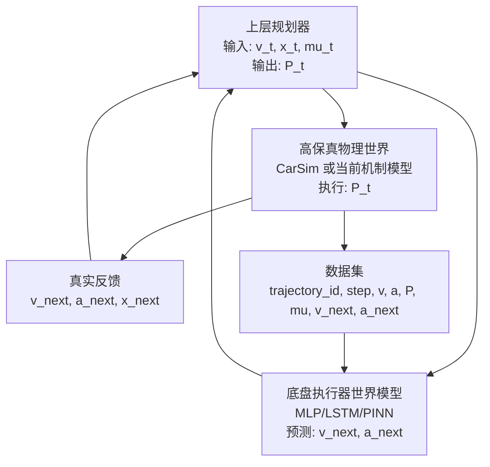

# 纵向制动系统 World Model 工程实现思路

## 1. 当前基础

当前工程已经完成了第一阶段闭环：

1. 用简化纵向制动机理模型生成伪真实 transition 数据。
2. 用 MLP 学习 `S_t + A_t -> S_{t+1}`，其中输入为 `[v_t, a_t, P_t, mu_t]`，输出为 `[v_next, a_next]`。
3. 在 MATLAB 中做了一个安全规划示例，用世界模型预测候选制动压力的下一步风险。

这个阶段本质上是系统辨识：证明神经网络能拟合制动系统局部动力学。下一阶段要把它升级成“基于预测的决策规划”。

## 2. 目标架构



三层职责要分清：

- 下层环境：负责尽可能真实地产生车辆响应。当前用机制模型，后续替换为 CarSim。
- 中层世界模型：负责学习底盘执行器动力学，给上层规划器提供快速可微或快速可采样的预测能力。
- 上层规划器：负责在未来预测时域内搜索压力序列，选择兼顾安全距离和舒适性的第一步制动压力。

## 3. 数据流设计

### 3.1 当前 transition 数据

当前 CSV：

```text
v_mps,a_mps2,pressure_MPa,mu,v_next_mps,a_next_mps2,brake_utilization,slip_risk
```

适合训练 MLP，但不包含连续时间上下文，因此不适合直接体现 LSTM 的优势。

### 3.2 升级后的时序数据

新增推荐格式：

```text
trajectory_id,step,time_s,v_mps,a_mps2,pressure_MPa,mu,
v_next_mps,a_next_mps2,brake_utilization,slip_risk
```

LSTM/GRU 输入过去 `K` 个时间步：

```text
[[v, a, P, mu]_{t-K+1}, ..., [v, a, P, mu]_t]
```

输出：

```text
[v_next, a_next]
```

这个格式同时兼容当前机制模型、Simulink 批量仿真和后续 CarSim 联合仿真。

## 4. CarSim 数据采集实施

### 4.1 Simulink 联合仿真搭建

1. 在 Simulink 中放置 CarSim S-Function 模块。
2. 输入端配置为全桥或四轮制动压力，先使用统一主缸压力 `P_MPa`。
3. CarSim 输出至少记录：
   - 车速 `v_mps`
   - 纵向加速度 `a_mps2`
   - 轮速和滑移率，可作为分析或未来扩展特征
   - 路面附着系数 `mu`
4. Simulink 外层脚本负责写入压力曲线、初速度和路面工况，并将仿真结果导出为 CSV。

工程中已提供完整的 CarSim 联调工具链：

- `scripts/inspect_carsim_interface.m`
- `scripts/create_carsim_brake_cosim_model.m`
- `scripts/setup_carsim_cosim.m`
- `scripts/generate_carsim_case_manifest.m`
- `scripts/carsim_collect_dataset.m`
- `scripts/calibrate_carsim_brake_gain.m`

由于 VehicleSim S-Function 的 Import/Export 和求解器参数与具体 CarSim Run 绑定，必须先由 CarSim `Send to Simulink` 生成 `models/carsim_seed_model.slx`，再由项目脚本自动封装。完整操作见 `docs/carsim_cosimulation_setup.md`。

### 4.2 采样范围

建议期末汇报版本先保持一维问题可控：

- 初速度：`20 - 120 km/h`
- 主缸压力：`0 - 10 MPa`
- 路面附着系数：`0.2, 0.4, 0.6, 0.8` 或连续采样 `0.2 - 0.8`
- 单条轨迹长度：`4 - 8 s`
- 采样步长：与当前模型一致，先用 `dt = 0.05 s`

### 4.3 采样策略

优先使用拉丁超立方采样或随机均匀采样覆盖初始条件；压力曲线不要只采样恒定压力，应包含：

- 恒定压力
- 线性升压
- 阶跃压力
- 随机平滑压力
- 前松后紧、前紧后松

这样 LSTM 才能学到压力变化历史和车辆响应之间的关系。

## 5. 模型升级

### 5.1 GRU 默认模型与 LSTM 对照

工程实现采用 PyTorch：

- 默认模型：单层 GRU
- 对照模型：LSTM
- 输入维度：`4`
- 输出维度：`2`
- 默认序列长度：`5`
- 训练脚本：`python/train_sequence_world_model.py`
- 消融脚本：`python/run_recurrent_ablation.py`

训练输出：

- `models/world_model_gru.pt`
- `results/sequence_world_model_metrics.csv`
- `results/sequence_training_loss.png`

当前八组消融实验表明，`GRU(sequence_len=5, hidden_size=64,
num_layers=1)` 在预测精度、参数量和训练时间之间取得了最佳综合平衡。完整结果见
`docs/recurrent_model_ablation.md`。

### 5.2 PINN 物理约束

在数据损失外，加入速度积分残差：

```text
r_v = v_next_pred - max(v_t + a_next_pred * dt, 0)
```

总损失：

```text
Loss = MSE(y_pred, y_true) + lambda_pinn * mean(r_v^2)
```

该约束的讲法很适合汇报：网络不是只靠黑盒拟合，而是被车辆纵向运动方程约束。

## 6. 上层规划器

一维直线刹停场景定义：

- 状态：`S_t = [v_t, x_t, a_t]`
- 动作：`A_t = [P_t]`
- 目标：车辆停住时距离障碍物约为安全距离 `d_safe`

采样式 MPC 过程：

1. 随机生成多条未来压力序列。
2. 用 LSTM/PINN 世界模型滚动预测未来 `N` 步。
3. 计算每条序列的代价。
4. 选择代价最低序列的第一步压力执行。
5. 收到下层环境反馈后，重新规划。

代价函数：

```text
J = w_distance * (x_stop - d_safe)^2
  + w_decel * mean(a_t^2)
  + w_jerk * mean((P_t - P_{t-1})^2)
  + collision_penalty
  + not_stop_penalty
```

示例脚本：`python/plan_stop_mpc.py`

输出：

- `results/mpc_stop_scenario.csv`
- `results/mpc_stop_scenario.png`

## 7. 6 月 9 日汇报闭环建议

三位同学可以这样拆：

- A：CarSim/Simulink 联调，按统一 CSV 格式导出高保真序列数据。
- B：训练 LSTM/PINN，对比 MLP、LSTM、PINN-LSTM 的 `MAE/RMSE/R2`。
- C：运行一维刹停 MPC，输出压力、速度、距离、减速度曲线，并组织 PPT。

汇报主线建议：

1. 我们先用机理模型跑通 world model 闭环。
2. 然后用时序模型解决液压/车辆动态的历史依赖。
3. 再把 world model 放进 MPC 规划器，让它不仅预测，还参与决策。
4. 最后用 CarSim 替代简化机制模型，提高伪真实数据保真度。
